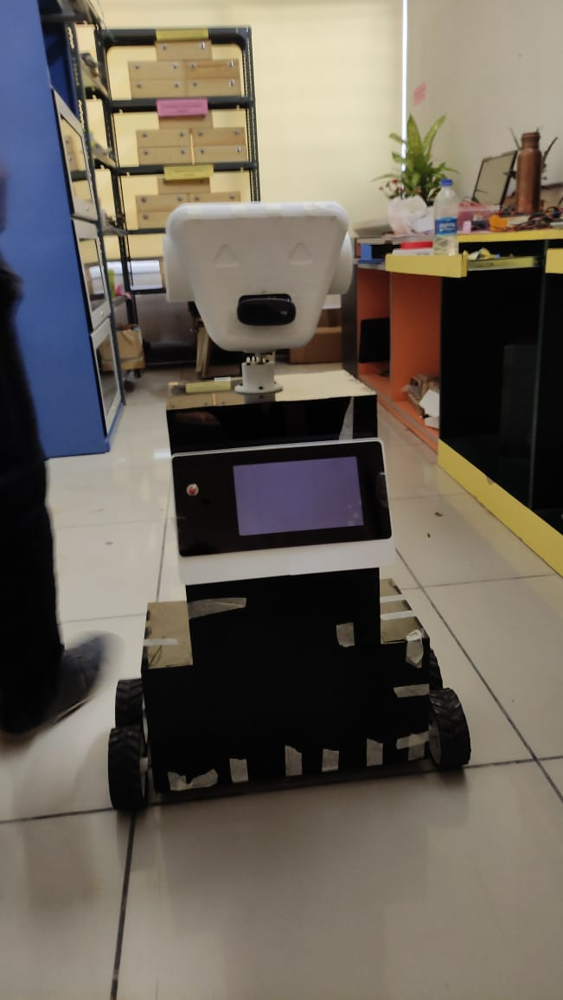

# AI Campus Assistant Robot

A smart, speech-enabled mobile robot designed to improve campus safety, navigation, and engagement by leveraging computer vision, voice assistant technology, retrieval-augmented generation (RAG), and IoT automation.

---



## What is this project?

This robot is a multi-modal AI platform built to help universities maintain safety and offer a personalized, interactive campus experience. By combining **face recognition, location-based question answering, social distancing enforcement, and IoT control**, this robot can:

- Guide **newcomers and parents** by answering questions and providing directions (using a custom RAG-powered campus Q&A system)
- **Recognize and greet university officials** upon facial identification
- **Enforce social distancing** and encourage students to return to classes during teaching hours
- **Control classroom lights/fans** based on real-time occupancy and academic timetables

The system is modular and can be tailored to other educational institutions or large organizations.

## Key Features

| Feature                                   | Description                                                                   | Technology Used            |
|-------------------------------------------|-------------------------------------------------------------------------------|----------------------------|
| **Person & Object Detection**             | Identify people/groups, maintain social distance, count classroom occupancy   | OpenCV (v4.2), YOLOv4-tiny |
| **Face Recognition**                      | Detect and greet VIPs (e.g., Principal, HODs, Chairman)                       | OpenCV, face_recognition   |
| **Voice Assistant & RAG**                 | Answer campus questions, provide directions, historical info                  | SpeechRecognition, gTTS, custom RAG with university data |
| **Smart Group Monitoring**                | Detect groups outside during periods, approach, and remind them to return     | PID movement control, CV   |
| **IoT & Automation**                      | Turn lights/fans on/off based on real-time occupancy and timetables           | MQTT/Nodemcu, Python       |
| **Multi-platform Integration**            | Modular code that can be repurposed for other campus/organization assistants  | Python, modular scripts    |

## How It Works

### 1. Campus Navigation & Q&A System (RAG Integration)
- Users ask location or department questions (“Where is the admin block?”).
- The robot uses Retrieval-Augmented Generation to answer accurately based on a university-specific knowledge base.

### 2. VIP Recognition Greetings
- The robot recognizes and greets university officials or VIPs via facial identification.
- Add/modify face data to suit your own staff or visitor list.

### 3. Social Distancing Enforcement & Group Monitoring
- Detects groups during class hours; approaches and reminds students to return to class.
- PID control ensures accurate robot navigation to the group.

### 4. Smart Room/Device Automation
- Monitors class occupancy; turns off lights/fans in empty rooms based on timetable.
- Integrates with IoT devices through MQTT/Nodemcu.

## Installation & Integration

1. **Clone the Repository**
    ```
    git clone https://github.com/hemanthpuppala/AI-Robot.git
    cd AI-Robot
    ```

2. **Update the Knowledge Base**
    - Edit the campus Q&A dataset to your institution's information.

3. **Set Up Face Recognition**
    - Add staff/VIP images and update labels in the face module.

4. **Configure Timetables and IoT**
    - Populate schedule files and configure MQTT broker/device details to match your setup.

5. **Install Dependencies**
    ```
    pip install opencv-python==4.2.0.*
    pip install numpy playsound gtts SpeechRecognition pyttsx3 face_recognition twilio pywhatkit pyautogui secure-smtplib geocoder
    ```

6. **Run the Application**
    ```
    python main.py
    # or, as appropriate per your entry point script
    ```

## Minimum Requirements

- **OS:** Windows, Linux, or Jetson Nano
- **Python:** >3.0 (recommend 3.7+)
- **OpenCV:** 4.2 (built from source)
- **Hardware:** Camera, microphone, speakers, motor drivers/relays, IoT nodes as needed

## Sample Applications

- University/campus navigation
- Corporate, hospital, or event assistant
- Security/monitoring robots
- Smart building automation

## Media
- Robot prototype Video (./VID-20230911-WA0018.mp4)


## License and Contribution

Contributions welcome. Please fork this repository and submit a pull request. **Do not commit secret credentials**.

## Contact & Support

For adapting to your organization or technical support, please open an issue or pull request.

---

*Empowering safe, smart, interactive campuses—one robot at a time.*
